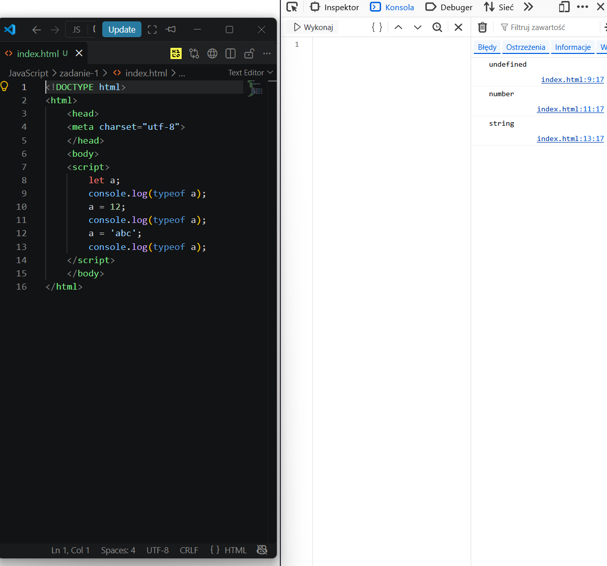
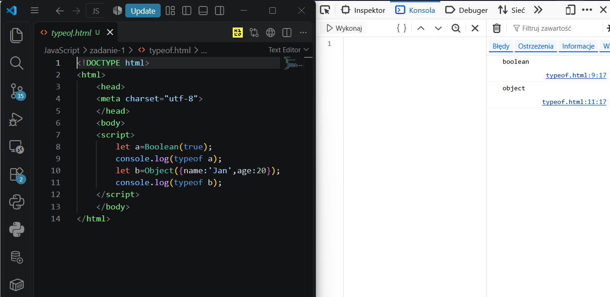
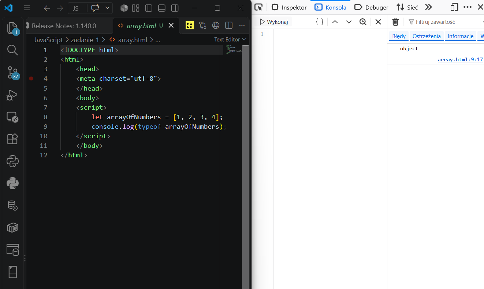
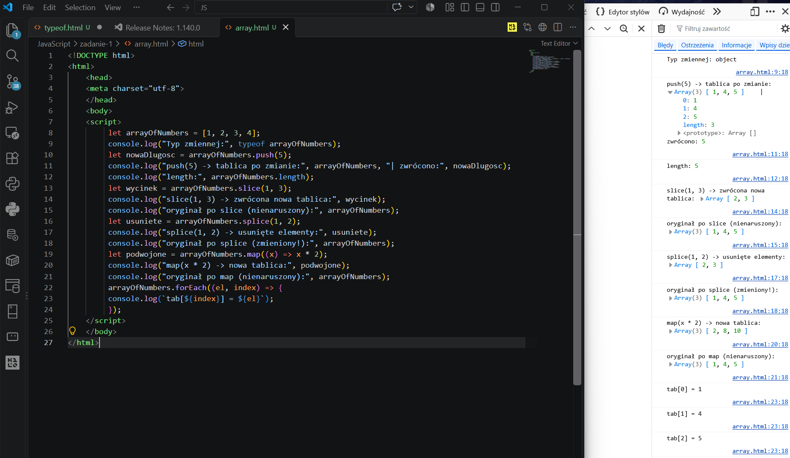
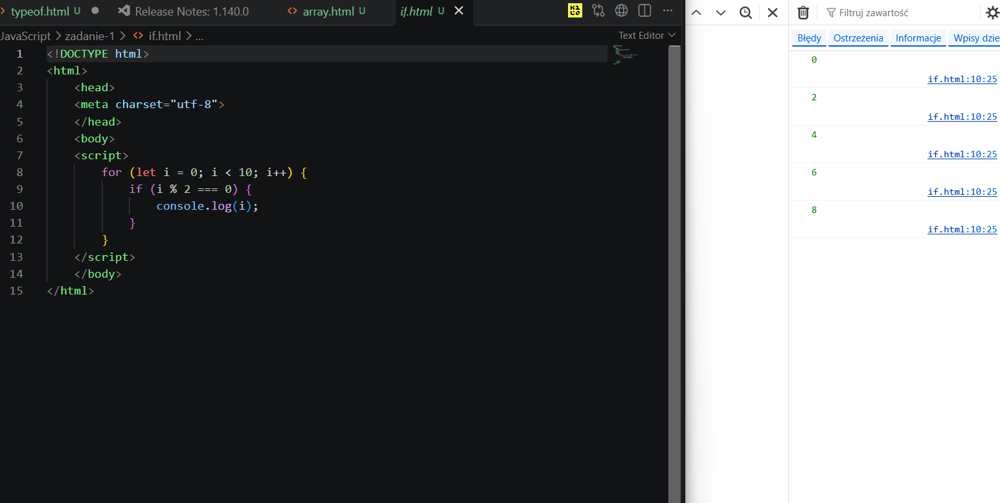
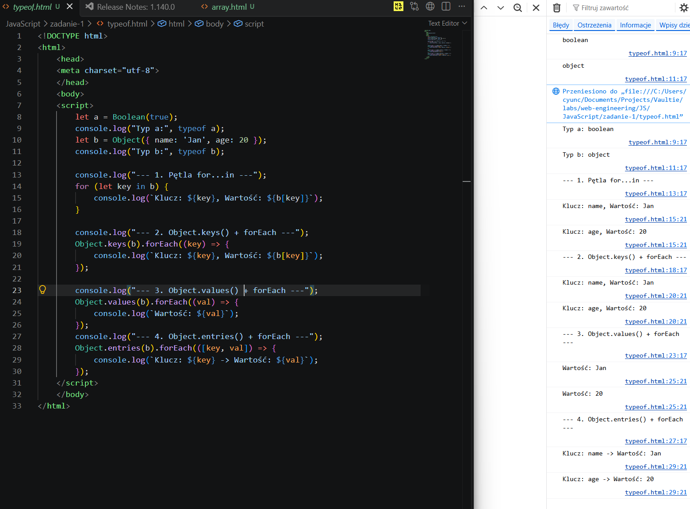
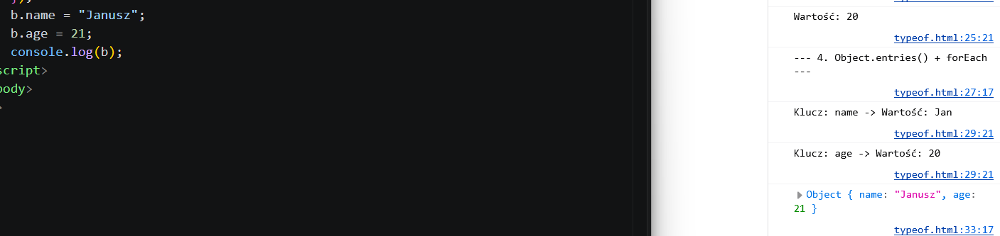
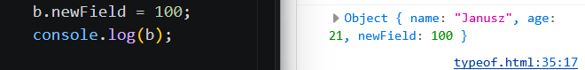

# Zadanie 1 – Wprowadzenie do JavaScript i DOM

Sprawozdanie z realizacji zadań pracowni specjalistycznej podstaw języka JavaScript: dynamicznego typowania, pracy z tablicami, obiektami oraz manipulacji drzewem DOM.

---

## 1. Brak typowania statycznego w JavaScript

### Kod bazowy do analizy:

```html
<!DOCTYPE html>
<html>
  <head>
    <meta charset="utf-8" />
  </head>
  <body>
    <script>
      let a;
      console.log(typeof a);
      a = 12;
      console.log(typeof a);
      a = "abc";
      console.log(typeof a);
    </script>
  </body>
</html>
```

### a) Wynik działania w konsoli przeglądarki

- **Obserwacja wyników:**
  - `let a;` &rarr; `undefined` – zmienna została zadeklarowana, lecz nie została zainicjalizowana żadną wartością, dlatego jej domyślnym typem i wartością w silniku JS jest `undefined`.
  - `a = 12;` &rarr; `number` – zmiennej przypisano literał liczbowy, w wyniku czego jej typ uległ zmianie na `number`.
  - `a = "abc";` &rarr; `string` – ponowne przypisanie wartości (ciąg znaków) skutkuje kolejną zmianą typu na `string`.

- **Zrzut ekranu z konsoli DevTools:**
  

---

### b) Jakie typy danych obsługuje JavaScript?

- **Typy proste (prymitywne):**
  - `number` – liczby całkowite i zmiennoprzecinkowe (podwójnej precyzji wg IEEE 754),
  - `string` – ciągi znaków tekstowych,
  - `boolean` – wartości logiczne (`true` / `false`),
  - `undefined` – domyślna wartość zmiennych zadeklarowanych bez przypisania,
  - `null` – celowa reprezentacja braku jakiejkolwiek wartości lub obiektu (uwaga: `typeof null === "object"` to zaszłość historyczna w silniku JS),
  - `symbol` – unikalne i niezmienne identyfikatory właściwości obiektów,
  - `bigint` – liczby całkowite o dowolnej precyzji, wykraczające poza bezpieczny zakres `Number.MAX_SAFE_INTEGER`.

- **Typy referencyjne / złożone:**
  - `object` – struktury klucz-wartość oraz wyspecjalizowane podtypy oparte na łańcuchu prototypów:
    - Tablice (`Array`),
    - Funkcje (`Function` – dla których operator `typeof` zwraca `"function"`),
    - Daty (`Date`), wyrażenia regularne (`RegExp`), mapy (`Map`, `Set`).

- **Komentarz / Wnioski:**
  > **Typy proste (prymitywy)** są niemutowalne (*immutable*) i przekazywane przez wartość (*by value*).  
  > **Typy referencyjne (złożone)** przechowują w zmiennej jedynie wskaźnik (referencję) do obszaru w pamięci sterty (*heap*), przez co ich przekazywanie i przypisanie odbywa się przez referencję (*by reference*).

---

### c) Czy typ zmiennej może się zmieniać w trakcie działania programu?

- **Odpowiedź i uzasadnienie:**
  > **Tak, typ zmiennej może ulegać wielokrotnym zmianom.**  
  > JavaScript jest językiem **dynamicznie oraz słabo typowanym** (*dynamically and weakly typed*). Oznacza to, że typ danych jest powiązany z **wartością** znajdującą się w pamięci, a nie ze **zmienną** (jej nazwą). Zmienna zadeklarowana słowem kluczowym `let` może w dowolnym momencie przyjąć wartość innego typu bez zgłoszenia błędu kompilacji, co stanowi fundamentalną różnicę w stosunku do języków o statycznym typowaniu, takich jak TypeScript, Java czy C#.

---

### d) Deklaracja zmiennych typu `boolean` i `object` oraz weryfikacja operatorem `typeof`

- **Fragment zrealizowanego kodu:**
  ```javascript
  let a = Boolean(true);
  console.log(typeof a);
  let b = Object({ name: "Jan", age: 20 });
  console.log(typeof b);
  ```

- **Wyniki w konsoli i wyjaśnienie:**
  - `typeof a` &rarr; `"boolean"` – wywołanie funkcji `Boolean(true)` dokonuje rzutowania wartości logicznej na typ prosty `boolean`.
  - `typeof b` &rarr; `"object"` – zmienna `b` przechowuje instancję typu referencyjnego `Object` zawierającą parę właściwości (`name`, `age`).

- **Zrzut ekranu:**
  

---

## 2. Tablice i ich metody

### a) Deklaracja i inicjalizacja tablicy liczb oraz weryfikacja typu

- **Kod:**
  ```javascript
  let arrayOfNumbers = [1, 2, 3, 4];
  console.log(typeof arrayOfNumbers);
  ```

---

### b) Weryfikacja typu zmiennej za pomocą `typeof`

- **Zwrócony typ:** `typeof arrayOfNumbers` = `"object"`
- **Weryfikacja wyniku i wyjaśnienie:**
  > W języku JavaScript tablica nie jest osobnym typem pierwotnym, lecz wyspecjalizowanym obiektem dziedziczącym po `Array.prototype`. Z tego powodu operator `typeof` zwraca dla tablic ogólny typ `"object"`.  
  > Aby w nowoczesnym kodzie rzetelnie i precyzyjnie sprawdzić, czy badana zmienna jest tablicą, należy stosować statyczną metodę **`Array.isArray(arrayOfNumbers)`**, która zwraca wartość logiczną `true`.

- **Zrzut ekranu:**
  

---

### c) Działanie wybranych metod tablicowych

Opis działania i wyniki przetestowanych metod:

| Metoda | Działanie / Cel | Modyfikuje tablicę źródłową? (Tak/Nie) | Wynik wywołania |
| :--- | :--- | :---: | :--- |
| **`push()`** | Dodaje element na koniec tablicy | **Tak** (mutująca) | Zwraca nową długość tablicy: `5` (tablica w pamięci: `[1, 2, 3, 4, 5]`) |
| **`length`** | Właściwość określająca liczbę elementów | **-** (właściwość) | Wartość numeryczna: początkowo `5`, po `splice`: `3` |
| **`sort()`** | Sortuje elementy tablicy | **Tak** (mutująca) | Zwraca tę samą tablicę posortowaną w miejscu (*in-place*) |
| **`slice()`** | Zwraca płytką kopię wybranego wycinka tablicy | **Nie** (niemutująca) | Zwraca nową tablicę: `[2, 3]` (oryginalna tablica pozostaje nienaruszona) |
| **`splice()`** | Usuwa i/lub wstawia elementy pod wskazanym indeksem | **Tak** (mutująca) | Zwraca tablicę usuniętych elementów: `[2, 3]` (tablica zredukowana do `[1, 4, 5]`) |
| **`map()`** | Przekształca każdy element za pomocą funkcji callback | **Nie** (niemutująca) | Zwraca nową tablicę: `[2, 8, 10]` (oryginał bez zmian: `[1, 4, 5]`) |
| **`forEach()`** | Wykonuje dostarczoną funkcję raz dla każdego elementu | **Nie** (iteracyjna) | Zwraca `undefined`, wypisuje w konsoli kolejne elementy: `tab[0]=1`, `tab[1]=4`, `tab[2]=5` |

- **Fragment kodu testującego metody:**

  ```javascript
  let arrayOfNumbers = [1, 2, 3, 4];
  console.log("Typ zmiennej:", typeof arrayOfNumbers);
  let nowaDlugosc = arrayOfNumbers.push(5);
  console.log(
    "push(5) -> tablica po zmianie:",
    arrayOfNumbers,
    "| zwrócono:",
    nowaDlugosc,
  );
  console.log("length:", arrayOfNumbers.length);
  let wycinek = arrayOfNumbers.slice(1, 3);
  console.log("slice(1, 3) -> zwrócona nowa tablica:", wycinek);
  console.log("oryginał po slice (nienaruszony):", arrayOfNumbers);
  let usuniete = arrayOfNumbers.splice(1, 2);
  console.log("splice(1, 2) -> usunięte elementy:", usuniete);
  console.log("oryginał po splice (zmieniony!):", arrayOfNumbers);
  let podwojone = arrayOfNumbers.map((x) => x * 2);
  console.log("map(x * 2) -> nowa tablica:", podwojone);
  console.log("oryginał po map (nienaruszony):", arrayOfNumbers);
  arrayOfNumbers.forEach((el, index) => {
    console.log(`tab[${index}] = ${el}`);
  });
  ```

- **Ważna obserwacja i analiza „paradoksu” konsoli (Lazy Evaluation & referencje obiektów):**

  > **Zaobserwowany pozorny paradoks w logach:**  
  > W konsoli przy wywołaniu:
  >
  > ```text
  > push(5) -> tablica po zmianie: Array(3) [ 1, 4, 5 ] | zwrócono: 5
  > length: 5
  > ```
  > Widzimy pozorną sprzeczność: `nowaDlugosc` i `length` wynoszą `5`, a jednocześnie podgląd tablicy `arrayOfNumbers` wypisuje `Array(3) [ 1, 4, 5 ]` – czyli stan tablicy dopiero **po** późniejszej operacji `splice(1, 2)`.
  >
  > **Dlaczego tak się dzieje?**
  > 1. **Typy prymitywne vs referencje:**
  >    - Zmienne `nowaDlugosc` oraz `arrayOfNumbers.length` to prymitywne liczby (`number`). Są one przekazywane do `console.log` przez wartość (kopię), więc ich wartość (`5`) zostaje utrwalona dokładnie w chwili wywołania.
  >    - Zmienna `arrayOfNumbers` to obiekt (referencja do tego samego obszaru w pamięci sterty).
  > 2. **Leniwa ewaluacja (*Lazy Evaluation*) w konsoli DevTools:**
  >    - Przeglądarka w momencie logowania obiektu nie tworzy jego głębokiej kopii w czasie rzeczywistym. Kiedy rozwijamy podgląd obiektu w konsoli (lub gdy konsola asynchronicznie formatuje podgląd), silnik DevTools odczytuje **aktualny stan referencji w pamięci**.
  >    - Ponieważ kod wykonuje się synchronicznie i ułamek milisekundy później metoda `splice(1, 2)` mutuje tablicę w miejscu do `[1, 4, 5]`, konsola w podglądzie referencji wyświetla już zmutowaną strukturę.
  > 3. **Wnioski inżynierskie:**
  >    - W celach precyzyjnego debugowania stanu obiektów/tablic w danym momencie kodu należy tworzyć ich migawkę (*snapshot*), np. za pomocą płytkiej kopii `console.log([...arrayOfNumbers])` lub serializacji `console.log(JSON.stringify(arrayOfNumbers))`.

- **Zrzuty ekranu:**
  

---

### d) Instrukcja warunkowa `if` (liczby parzyste)

- **Zastosowany warunek:**
  ```javascript
  for (let i = 0; i < 10; i++) {
    if (i % 2 === 0) {
      console.log(i);
    }
  }
  ```

- **Wynik w konsoli:**
  > 0  
  > 2  
  > 4  
  > 6  
  > 8  

- **Komentarz:**
  > Operator modulo `% 2 === 0` pozwala sprawdzić, czy reszta z dzielenia przez 2 wynosi zero, co jednoznacznie identyfikuje liczby parzyste. Tę samą logikę można zintegrować wewnątrz callbacku metody `arrayOfNumbers.forEach()`.

- **Zrzut ekranu:**
  

---

## 3. Obiekty i ich metody

### a) Deklaracja obiektu z co najmniej dwoma polami

- **Kod:**
  ```javascript
  let b = Object({ name: "Jan", age: 20 });
  ```

---

### b) Wyświetlenie pól i wartości obiektu (iteracja)

- **Zastosowany sposób iteracji:**
  > Obiekt w JavaScript nie posiada bezpośredniej metody `forEach` (próba wywołania `b.forEach()` kończy się błędem `TypeError: b.forEach is not a function`), ponieważ nie implementuje protokołu `Iterable`.  
  > Aby przeiterować po polach i wartościach obiektu, można skorzystać z:
  > 1. **Tradycyjnej pętli `for...in`** – iteruje po wszystkich wyliczalnych kluczach obiektu (wartość pobierana dynamicznie przez notację nawiasową `b[key]`).
  > 2. **`Object.keys(b).forEach()`** – pobiera tablicę własnych kluczy obiektu i iteruje po niej metodą tablicową.
  > 3. **`Object.values(b).forEach()`** – iteruje bezpośrednio po tablicy wartości pól.
  > 4. **`Object.entries(b).forEach(([key, val]) => ...)`** – najbardziej idiomatyczne podejście w nowoczesnym JavaScript, zwracające tablicę par `[klucz, wartość]`.

- **Kod:**

  ```javascript
  let b = Object({ name: "Jan", age: 20 });
  console.log(typeof b);
  for (let key in b) {
    console.log(key);
  }
  Object.keys(b).forEach((key) => {
    console.log(key);
  });
  Object.values(b).forEach((val) => {
    console.log(val);
  });
  Object.entries(b).forEach(([key, val]) => {
    console.log(key, val);
  });
  ```

- **Zrzut ekranu:**
  

---

### c) Zmiana wartości poszczególnych pól

- **Kod aktualizujący wartości:**
  ```javascript
  b.name = "Janusz";
  b.age = 21;
  ```

- **Stan obiektu po modyfikacji (zrzut ekranu):**
  

---

### d) Dodanie nowego pola do obiektu

- **Odpowiedź:** Czy można dodać nowe pole do obiektu w JS? W jaki sposób?
  > **Tak, obiekty w JavaScript są domyślnie strukturami otwartymi na rozbudowę (*extensible*).**  
  > Nowe pole można dodać w dowolnym momencie działania programu za pomocą:
  > - **Notacji kropkowej:** `b.newField = 100;`
  > - **Notacji nawiasowej:** `b["newField"] = 100;` (przydatnej, gdy nazwa klucza pochodzi ze zmiennej lub zawiera znaki specjalne).
  > - Metody statycznej `Object.assign(b, { newField: 100 })` lub operatora spread `{ ...b, newField: 100 }`.

- **Kod i zrzut ekranu:**
  ```javascript
  b.newField = 100;
  ```
  

---

## 4. Manipulacja DOM w dokumencie HTML

### a) Struktura początkowa dokumentu HTML

- Element `<h1>` o treści `"Nowa lista"`
- Lista `<ul>` zawierająca elementy: `"jeden"`, `"dwa"`, `"trzy"`

- **Kod HTML:**
  ```html
  <h1 id="tytul">Nowa lista</h1>
  <ul id="lista">
    <li id="el1">Jeden</li>
    <li id="el2">Dwa</li>
    <li id="el3">Trzy</li>
  </ul>
  ```

- **Stan początkowy (zrzut ekranu):**
  

---

### b) Przycisk 1: Zmiana nagłówka `<h1>`

- **Działanie:** Po kliknięciu tekst nagłówka zmienia się na `"Stara lista"`, a kolor fontu na niebieski (`blue`).
- **Zastosowane metody i właściwości DOM:**
  - `document.getElementById("tytul")` – selekcja węzła w drzewie DOM po unikalnym identyfikatorze,
  - `addEventListener("click", ...)` – asynchroniczne nasłuchiwanie zdarzenia kliknięcia,
  - `element.textContent` – bezpieczna zmiana zawartości tekstowej węzła (zapobiega podatnościom XSS),
  - `element.style.color` – bezpośrednia modyfikacja stylu liniowego CSS elementu.

- **Kod JavaScript:**

  ```javascript
  let lista = document.getElementById("tytul");
  lista.addEventListener("click", function () {
    lista.textContent = "Stara lista";
    lista.style.color = "blue";
  });
  ```

- **Zrzut ekranu po kliknięciu:**
  

---

### c) Przycisk 2: Dodanie nowego elementu `"cztery"` do listy `<ul>`

- **Działanie:** Po kliknięciu do listy dopinany jest nowy element `<li>` o treści `"cztery"`.
- **Zastosowane metody i techniki DOM:**
  - `document.createElement("li")` – fabrykowanie nowego elementu DOM w pamięci podręcznej,
  - `nowyElement.textContent = "cztery"` – ustawienie tekstu w nowym węźle,
  - `lista.appendChild(nowyElement)` – fizyczne wpięcie węzła jako ostatnie dziecko listy `<ul>`,
  - `lista.removeEventListener("click", ...)` – wyrejestrowanie listenera po pierwszym wywołaniu, gwarantujące jednorazowe wykonanie operacji.  
    *(Współczesną, rekomendowaną alternatywą w standardzie DOM jest przekazanie opcji `{ once: true }` w `addEventListener`).*

- **Kod JavaScript:**

  ```javascript
  let lista2 = document.getElementById("lista");
  lista2.addEventListener("click", function () {
    let nowyElement = document.createElement("li");
    nowyElement.textContent = "cztery";
    lista2.appendChild(nowyElement);
    lista2.removeEventListener("click", arguments.callee);
    //usuniecie listenera po pierwszym kliknięciu, dzięki temu event listener jest wywoływany tylko raz.
  });
  ```

- **Zrzut ekranu po kliknięciu:**
  

---

## Podsumowanie i wnioski

1. **Typowanie w JS:** Język jest typowany dynamicznie – typ przypisany jest do wartości, a nie do zmiennej, dlatego ta sama zmienna może zmieniać typ w trakcie działania programu. Tablica pod kątem typu jest obiektem (`typeof [] === "object"`), więc do jej rzetelnego sprawdzenia służy `Array.isArray()`.
2. **Tablice i mutowalność:** Metody takie jak `push`, `sort` i `splice` modyfikują tablicę źródłową w miejscu, a `slice` oraz `map` tworzą i zwracają nową tablicę. Przeglądarka w konsoli korzysta z referencji (leniwa ewaluacja), dlatego po rozwinięciu obiektu widać jego aktualny, późniejszy stan w pamięci.
3. **Obiekty:** Zwykły obiekt nie ma metody `forEach`. Żeby przejść po jego polach i wartościach, najwygodniej użyć pętli `for...in` albo metod pomocniczych `Object.keys()`, `Object.values()` i `Object.entries()`. Nowe pola można dopisywać dynamicznie w dowolnej chwili.
4. **Manipulacja DOM:** Podstawowe operacje w czystym JS to pobranie elementu (`getElementById`), zmiana tekstu (`textContent`) i styli (`style.color`) oraz tworzenie i dodawanie węzłów (`createElement`, `appendChild`). Obsługa zdarzeń przez `addEventListener` pozwala dynamicznie reagować na kliknięcia, a usunięcie listenera zapobiega powielaniu akcji.
